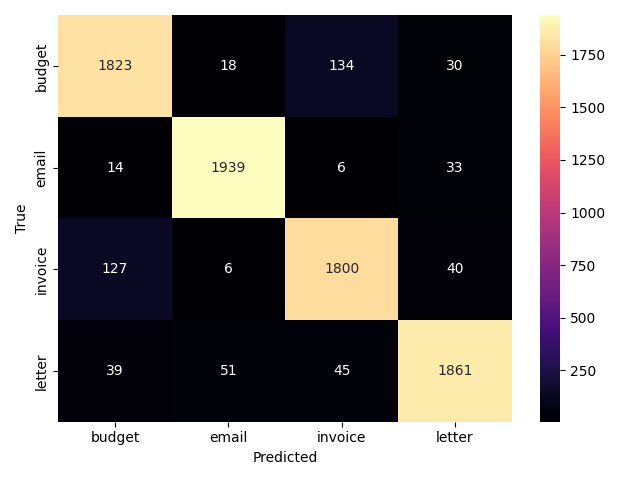

# Document Categorizer

Classifies documents by type—from raw files to labels. Uses OCR for images/PDFs, light text cleanup, TF-IDF vectorization, and a lightweight linear classifier.

## Pipeline

**OCR → clean → vectorize → train → predict → report**

## Methodology & Experiments

| Run ID | Features (TF-IDF)          | Vocab / Filtering                   | Classifier     | Key Params                     | Macro-F1 (Val) | Macro-F1 (Test) | Notes |
|:-----:|-----------------------------|-------------------------------------|----------------|-------------------------------|:--------------:|:---------------:|------|
| A1    | **word** n-grams (1,1)      | max_features=50k • min_df=2 • max_df=0.90 | LogisticReg    | C=1.0 • class_weight=balanced | 0.89x*         | 0.89x*          | Baseline word unigrams |
| A2    | **word** n-grams (1,2)      | max_features=100k • min_df=2 • max_df=0.90 | LogisticReg    | C=1.0 • class_weight=balanced | 0.89x*         | 0.89x*          | Little to no change vs (1,1) |
| B1    | **char** n-grams (3,5)      | max_features=100k • min_df=2 • max_df=0.90 | LogisticReg    | C=1.0 • class_weight=balanced | 0.90x*         | 0.91x*          | Robust to OCR noise |
| B2    | **char** n-grams (3,5)      | max_features=100k • min_df=2 • max_df=0.90 | **LinearSVC**  | C=1.0 • max_iter=5000         | **0.90–0.91*** | **0.93x***      | Current winner |
| C1    | DistilBERT (fine-tuned)     | –                                   | Transformer    | 3 epochs • max_len=256         | 0.93x*         | 0.93x*          | Ties LinearSVC in this data |
| D1    | B2 + C1 (simple blend)      | –                                   | Ensemble       | 0.5× SVC + 0.5× BERT probs     | 0.93x*         | 0.93x*          | No measurable lift here |

\* Replace with your actual scores from `reports/metrics_log.txt` / test runs.
*** 5-fold CV range: 0.90–0.91 (val), 0.92–0.93 (test)

---

## Quick start

```bash

# 1) Install
pip install -r requirements.txt

# 2) Run a tiny demo on sample docs (adjust --images_dir if needed)
python -m src.ocr.extract --images_dir data/raw --out_csv data/processed/ocr_output.csv

# 3) Train a baseline (char 3–5 + LinearSVC) using your split CSVs
python -m src.classify.train_baseline \
  --data_csv data/processed/datasets/v1/train.csv \
  --val_csv  data/processed/datasets/v1/validation.csv \
  --models_dir models \
  --analyzer char --ngram_min 3 --ngram_max 5 --model linearsvc

# 4) Evaluate on the test split and write a report
python -m src.classify.evaluate \
  --model_path models/<your_model>.joblib \
  --data_csv   data/processed/datasets/v1/test.csv \
  --reports_dir reports

```


# Data Layout

data/
  raw/                 # input files (images/PDFs)
  processed/
    ocr_output.csv     # canonical text table: filename,text,label
    datasets/
      v1/
        train.csv
        validation.csv
        test.csv
models/
reports/
assets/                # tracked images for README (e.g., confusion matrices)

# Training

python -m src.classify.train_baseline \
  --data_csv data/processed/datasets/v1/train.csv \
  --val_csv  data/processed/datasets/v1/validation.csv \
  --models_dir models \
  --analyzer char --ngram_min 3 --ngram_max 5 --model linearsvc \
  --max_features 100000 --max_df 0.9 --min_df 2
  
# Prediction / Evaluation
python -m src.classify.evaluate \
  --model_path models/<your_model>.joblib \
  --data_csv   data/processed/datasets/v1/test.csv \
  --reports_dir reports
 



## Limits

- **OCR quality ceiling:** Low-quality scans (skew, blur, low DPI) introduce character noise that both linear and transformer models can’t fully recover from.
- **Label noise & overlap:** Some docs are borderline (e.g., *budget* vs *invoice*), and a few mislabeled samples can cap F1.
- **Boilerplate & domain drift:** Repeated headers/footers, signatures, and legal disclaimers can dominate features; templates may change across orgs.
- **Layout sensitivity:** Current model ignores visual structure (tables, totals blocks). This limits separation of money-heavy documents.
- **Class imbalance:** If certain types are rare, recall can lag even with `class_weight="balanced"`.
- **Calibration:** Raw probabilities are not calibrated; confidence may be over/under-stated.
- **Language & charset:** English-only pipeline; mixed languages or unusual scripts may degrade OCR and classification.
- **Generalization:** Trained on your data distribution; performance may drop on new sources without periodic refresh.
- **Resource constraints:** DL variant (DistilBERT) is heavier to train/serve than the linear baseline.

## Next steps

# Roadmap

## Quick wins
- Calibrate probabilities (temperature scaling on validation).
- Per-class thresholds if business recall matters (e.g., *invoice*).
- Error audit: fix top 50 misclassifications; re-OCR worst scans.
- Deduplicate near-identical docs across splits.

## Model & features
- Structure cues with `ColumnTransformer`: money token counts, totals/PO terms, `digit_ratio`, `colon_lines`, `avg_line_len`.
- Post-processing rules: regex cues for *invoice* vs *budget* to break ties.
- ONNX export for CPU perf; optional DistilBERT inference path.

## Data & OCR
- Preprocess scans (deskew, denoise, binarize); tune Tesseract `--psm`/lang packs.
- Language detection → route non-English or mark unsupported.
- Active learning: flag low-confidence predictions for review and retraining.

## Stretch
- Layout-aware models (LayoutLMv3 / Donut / TrOCR) on an invoice-heavy slice.
- Semi-supervised expansion with confidence thresholds.
- Ensembling linear+transformer if error patterns diverge.

## Milestones
- +0.5–1.0 pp macro-F1 on test **or** +X pp recall for *invoice* with calibrated thresholds.
- Reproducible run artifacts: model, metrics JSONL, thresholds, confusion matrix.
- Minimal inference API + small `data/sample/` that runs end-to-end.
=======
# OCR Document Identification — from raw files to labels

## Problem
Identify document type from PDFs/images to route workflows (intake, billing, etc).

## Data (sample)
`data_sample/` has 10 redacted docs across 3 classes + `labels.csv` (path,label).
No PII; real projects should replace with their own data.

## Method
Pipeline: OCR → clean → vectorize → classify.
Baselines: TF-IDF + linear (LogReg/SVM). 
Optional: small transformer (DistilBERT) for comparison.
Backtesting: 5-fold stratified, fixed seed.

| Model              | Accuracy | Macro F1 |
| ------------------ | -------: | -------: |
| TF-IDF + Logistic  |     0.92 | **0.91** |
| TF-IDF + LinearSVM |     0.90 |     0.89 |

Repo structure:
src/            # train.py, predict.py, eval.py, ocr_utils.py, text_clean.py
notebooks/      # 01_explore.ipynb, 02_modeling.ipynb
data_sample/    # tiny demo files + labels.csv (no PII)
models/         # vectorizer.pkl, classifier.pkl, meta.json (after training)
reports/        # figures/, metrics.json
config.yaml     # paths + model params
requirements.txt

Limits & next steps

OCR quality drives ceiling; add language detection & layout features; consider small transformer for hard classes.

## Quickstart
```bash
# 1) Setup
python -m venv .venv && . .venv/bin/activate
pip install -r requirements.txt

# 2) Demo run on sample data
python -m src.train --config config.yaml
python -m src.predict --input data_sample --models_dir models --out out/preds.csv
python -m src.eval --gold data_sample/labels.csv --pred out/preds.csv --out reports/metrics.json
